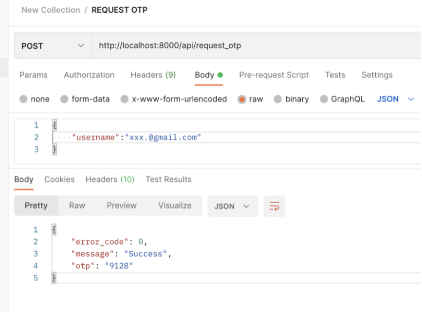
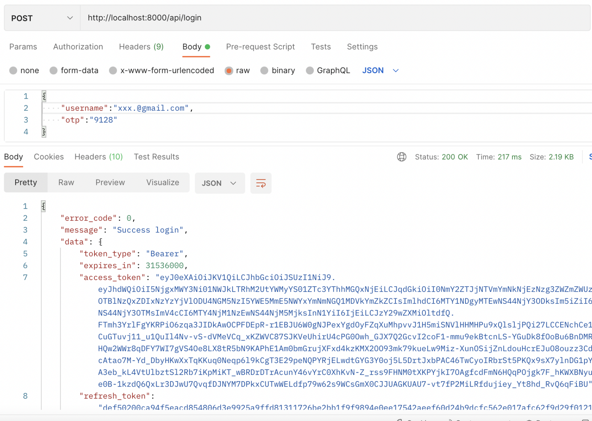

# EXAMPLE - OTP WITH LARAVEL PASSPORT #
This is an example how to create otp authentication using laravel passport. In this tutorial I add custom Grant, I call this `OtpGrant`.  
You can see that in `App\Auth\Grants\OtpGrant`.

## STACK ##
- Laravel 9
- MySQL/Maria DB
- Redis

## ENV ##
In `.env` file add some variable below :  
CLIENT_ID=`<Your client id>` 
CLIENT_SECRET=`<Your client secret>` 
OTP_LIFETIME=120 
OTP_DIGITS=6

## STEP ##
- Do all step to install <a href="https://laravel.com/docs/9.x/passport">`laravel passport`</a> in your project
- RUN `composer require predis/predis` to add predis library

## API ##
- `api/request_otp` [POST with parameter `username`]

- `api/login` [POST with parameter `username` and `otp`]

<i>Note :</i>
- This tutorial is only generate and request token by otp, not send the otp via email or sms
- This tutorial is using email for generate otp. You can custom that such as add phone number for authentication and send that